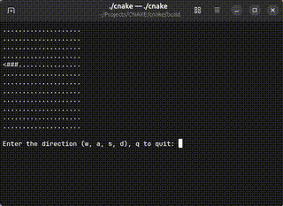

# CNAKE


CNAKE is a classic snake game that runs entirely in the command line (terminal) without any graphical user interface.

This project is primarily developed as a personal exercise to explore algorithm implementation, data structures, and real-world application development using modern C++.

---

# Overview

CNAKE recreates the classic snake gameplay experience in a minimal environment: the terminal.

The game is implemented purely in C++ using the **C++20 standard** and relies only on the **C++ standard library** for its core systems.

The main goal of this project is to deepen understanding of software development processes and system design while building a fully functional terminal-based application.

---

## Demo

Below is a preview of **CNAKE** running directly in the terminal.

At the current stage of development, the core grid system and snake representation are already implemented.



*Early development preview of CNAKE running in the terminal.*

---

# Quick Start

If you already have **Git**, **CMake**, and a **C++ compiler** installed, you can build CNAKE quickly with the following steps:

```
git clone https://github.com/ndykaman/cnake.git
cd cnake

mkdir build
cd build

cmake ..
cmake --build .
```

After the build finishes, run the game:

```
./cnake
```

---

# Requirements

*note: If you are unfamiliar with these tools, follow the installation instructions below carefully.*

Before building CNAKE, you need to install a few basic development tools.
These tools are commonly used in C++ projects and are required to compile the program.

The required tools are:

* **Git** – used to download (clone) the source code from GitHub
* **CMake** – used to generate build files for the project
* **C++ Compiler** – used to compile the C++ source code (GCC or Clang recommended)

Below are installation instructions for common operating systems.

---

# Installing Requirements

## Linux (Ubuntu / Debian)

Open a terminal and run:

```
sudo apt update
sudo apt install git cmake build-essential
```

This command installs:

* **Git**
* **CMake**
* **GCC / G++ compiler**
* other essential development tools

After installation, you can verify everything is installed correctly:

```
git --version
cmake --version
g++ --version
```

---

## Windows

On Windows, you need to install the required tools manually.

### 1. Install Git

Download Git from the official website:

https://git-scm.com/downloads

Run the installer and follow the setup instructions.
After installation, open **Command Prompt** or **PowerShell** and check:

```
git --version
```

---

### 2. Install CMake

Download CMake from:

https://cmake.org/download/

During installation, make sure to select:

```
Add CMake to the system PATH
```

After installation, verify it:

```
cmake --version
```

---

### 3. Install a C++ Compiler

The easiest way is installing **MinGW-w64**.

Download it from:

https://sourceforge.net/projects/mingw-w64/

After installing, verify:

```
g++ --version
```

> **Note**
>
> If you are new to installing development tools such as Git, CMake, or a C++ compiler, you may find it helpful to follow step-by-step tutorials.
>
> There are many beginner-friendly guides available online, including articles and video tutorials. Searching for topics such as:
>
> * "install Git on Windows"
> * "install CMake on Ubuntu"
> * "install MinGW g++ on Windows"
>
> can provide visual walkthroughs that may be easier to follow.


---

# Quick Check

If all tools are installed correctly, running these commands should show version information:

```
git --version
cmake --version
g++ --version
```

If these commands work, your system is ready to build **CNAKE**.


---

# Installation (Step by Step)

1. **Clone the repository**

```
git clone https://github.com/ndykaman/cnake.git
```

2. **Enter the project directory**

```
cd cnake
```

3. **Create a build directory**

```
mkdir build
cd build
```

4. **Generate build files using CMake**

```
cmake ..
```

5. **Compile the project**

```
cmake --build .
```

After compilation finishes, the executable file will be generated inside the `build` directory.

---

# Running the Game

To start the game:

```
./cnake
```

If you are not inside the build directory:

```
cd build
./cnake
```

---

# Controls

```
W / A / S / D  - Move the snake
Q              - Quit the game
```

*(Controls may change during development.)*

---

# Concept

The core idea behind CNAKE is simple:

> Bring the classic snake game experience directly into the terminal.

Unlike many modern implementations that rely on graphical frameworks, CNAKE intentionally avoids any GUI and focuses on terminal-based gameplay.

This design encourages exploration of:

* low-level program structure
* algorithm design
* data structure implementation
* modular C++ project organization
* build system integration with CMake

---

# Current Development Status

CNAKE is currently in **early development and experimental stage**.

Core systems that are being implemented and refined include:

* Snake movement system
* Food / reward mechanics
* Score system
* Game space management
* Core game loop

Because the project is still under active development, features and gameplay behavior may change.

---

# Technologies

CNAKE is built using:

* **C++20**
* **CMake**
* **C++ Standard Library**

No external libraries are currently used for the core implementation.

---

# Project Structure

```
cnake/
│
├── src/
│   ├── main
│   ├── snake
│   ├── coordinate
│   └── direction
│
├── .gitignore
├── CMakeLists.txt
└── README.md
```

---

# Target Users

CNAKE is intended for anyone interested in experiencing a classic snake game directly in the terminal.

It may also be useful for:

* developers learning modern C++
* programmers exploring terminal-based applications
* students studying algorithmic game logic

---

# License

This project is licensed under the **MIT License**.
